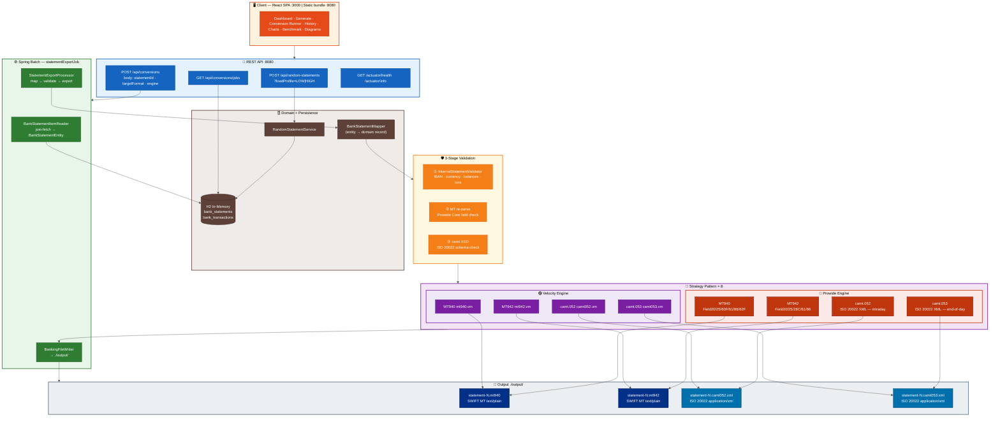
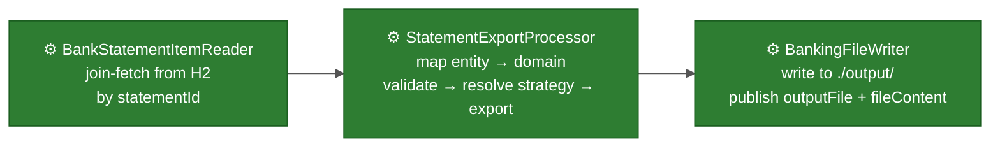

<p align="center">
  
  &nbsp;&nbsp;&nbsp;&nbsp;
  
</p>

# Banking Statement Converter Platform

[](https://github.com/wallaceespindola/camt-mt-converters/actions/workflows/build.yml)
[](https://github.com/wallaceespindola/camt-mt-converters/actions/workflows/test.yml)
[](https://github.com/wallaceespindola/camt-mt-converters/actions/workflows/codeql.yml)
[](https://adoptium.net/)
[](https://spring.io/projects/spring-boot)
[](https://spring.io/projects/spring-batch)
[](https://www.swift.com/standards/data-standards/mt)
[](https://www.iso20022.org/catalogue-messages/iso-20022-messages-archive?search=camt)
[](https://github.com/prowide)
[](LICENSE)

Enterprise-grade banking statement converter platform. Converts internal domain data to **MT940, MT942, camt.052, camt.053** banking file formats using **Prowide Core + ISO 20022**, via **Spring Batch** and the **Strategy Pattern**.

---

## Overview

This platform is a production-ready reference implementation for banking format conversion. Engineers can generate realistic bank statement datasets and trigger Spring Batch export jobs that produce standards-compliant SWIFT MT and ISO 20022 camt files via either the Prowide library suite or Apache Velocity templates.

Two parallel conversion engines are available behind a single `StatementExportStrategy` interface. The **Prowide engine** uses strongly-typed, standards-aware Java objects for MT940, MT942, camt.052, and camt.053. The **Velocity engine** uses declarative `.vm` templates for the same four formats — both engines pass the same post-generation validation before any file is written to disk.

The system is designed to be extended without modification: adding a new format or engine means implementing one interface and annotating the class `@Component`. The `StatementExportStrategyFactory` auto-discovers all registered strategies at startup via Spring dependency injection — no `if`/`switch` chains in the resolution path.

---

## SWIFT MT and ISO 20022 in European Banking

### SWIFT MT (Message Types)

SWIFT MT messages are the legacy text-based messaging standard used by banks and financial institutions globally for decades. In the European banking landscape:

- **MT940** — Customer Statement Message: the backbone of end-of-day account reporting in European cash management. Banks including Deutsche Bank, BNP Paribas, Société Générale, ING, and ABN AMRO provide MT940 files to corporate clients for automated reconciliation.
- **MT942** — Interim Transaction Report: intraday liquidity reporting widely used by European corporates and their banks (e.g., Commerzbank, UniCredit, Santander) to monitor real-time cash positions before the end-of-day statement is issued.
- **SEPA compliance**: European banks producing MT940/MT942 embed SEPA-compliant structured remittance data (field 86) aligned with the EPC's pain/camt rulebooks, enabling straight-through processing in ERP systems (SAP, Oracle Financials).
- **ECB and TARGET2**: The European Central Bank's TARGET2 RTGS system uses SWIFT MT messages for interbank settlement instructions across the Eurozone's 20 member states.

### ISO 20022 / camt (Cash Management)

ISO 20022 is the global XML-based financial messaging standard mandated by the European Payments Council (EPC) and progressively replacing SWIFT MT across European market infrastructures:

- **camt.052** (Bank-to-Customer Account Report): intraday reporting replacing MT942. Adopted by TIPS (TARGET Instant Payment Settlement) and mandated in the ECB's ISO 20022 migration roadmap for TARGET2/T2S from November 2022.
- **camt.053** (Bank-to-Customer Statement): end-of-day reporting replacing MT940. Mandatory for all SEPA Credit Transfer and SEPA Direct Debit reporting under EPC guidelines. Supported by all major EU clearinghouses — STEP2 (EBA Clearing), CORE (France), and EQUENS (Netherlands/Germany).
- **SWIFT MX migration**: SWIFT's global MT-to-MX migration (completed November 2025) requires all correspondent banks to support ISO 20022 natively. European banks — Barclays, HSBC, Rabobank, KBC, Erste Group — are fully migrated.
- **PSD2 / Open Banking**: ISO 20022 camt messages are the standard data format for Account Information Service Providers (AISPs) accessing bank account data under the EU's Payment Services Directive 2.
- **European Central Bank**: The ECB's Consolidated Tape and T2 consolidation project mandates camt.052/053 for all Eurosystem participants reporting to the TARGET Services platform.

### Format Adoption Timeline in Europe

| Year | Milestone |
|------|-----------|
| 2008 | SEPA Credit Transfer goes live — ISO 20022 pain.001/pain.002 adopted by EPC |
| 2014 | SEPA migration deadline — all EUR payments in the Single Euro Payments Area use ISO 20022 |
| 2017 | ECB announces TARGET2 ISO 20022 migration roadmap |
| 2019 | EBA Clearing's STEP2 adds camt.054 credit notification support |
| 2022 | TARGET2/T2S consolidated platform goes live with full ISO 20022 support (Nov) |
| 2023 | SWIFT mandates ISO 20022 for all cross-border payments in MX format |
| 2025 | SWIFT MT coexistence period ends — ISO 20022 is the sole standard for new messages |

---

## Architecture



### Batch Pipeline



Each Spring Batch job is parameterised by `statementId`, `targetFormat`, and `engine`. A unique `runId` timestamp ensures the same statement can be re-converted in any combination without Spring Batch rejecting it as a duplicate.

### Strategy Pattern

Eight strategies are auto-discovered at startup via Spring DI. The `StatementExportStrategyFactory` maps each to a composite key `StatementExportStrategyKey(targetFormat, engine)` — O(1) lookup, no branching logic.

---

## Supported Banking Formats

| Standard    | Format   | Description                                | Authority  | Functional Equivalent |
|-------------|----------|--------------------------------------------|------------|----------------------|
| **SWIFT MT**    | **MT940**    | Customer Statement Message — end-of-day    | SWIFT      | = camt.053           |
| **SWIFT MT**    | **MT942**    | Interim Transaction Report — intraday      | SWIFT      | = camt.052           |
| **ISO 20022**   | **camt.052** | Bank-to-Customer Account Report — intraday | ISO / BIS  | = MT942              |
| **ISO 20022**   | **camt.053** | Bank-to-Customer Statement — end-of-day    | ISO / BIS  | = MT940              |

> **SWIFT MT** messages use a tag-based text format (`:20:`, `:25:`, `:61:`, `:86:`, …).
> **ISO 20022 camt** messages use structured XML validated against published XSD schemas.

---

## Conversion Engine Comparison

| Engine              | Formats                          | Type-Safety    | Validation         | Risk |
|---------------------|----------------------------------|----------------|--------------------|------|
| **Prowide Core**        | MT940, MT942                     | High           | Field re-parse     | Low  |
| **Prowide ISO 20022**   | camt.052, camt.053               | High           | XSD                | Low  |
| **Apache Velocity**     | MT940, MT942, camt.052, camt.053 | Template-based | MT re-parse or XSD | Low  |

The Prowide engine uses strongly-typed Java objects (`MT940`, `Field60F`, `MxCamt05300108`, etc.) that enforce SWIFT and ISO 20022 constraints at the object level. The Velocity engine renders `.vm` templates in `src/main/resources/templates/` and is useful for rapid iteration or human-readable template editing. Both pass the same post-generation validation gate before writing to disk.

---

## Quick Start

### Prerequisites

- Java 21+ (tested with Amazon Corretto 21 and Eclipse Temurin 21)
- Maven 3.9+
- Node.js 22+ and npm 10+ _(only needed to build or develop the React frontend)_
- `make` _(optional — simplifies commands)_
- `curl` + `jq` _(optional — for the API examples below)_

### Installing `make`

| Platform            | Command                                                                                  |
|---------------------|------------------------------------------------------------------------------------------|
| **macOS**           | `xcode-select --install` (Xcode Command Line Tools) or `brew install make`               |
| **Ubuntu / Debian** | `sudo apt-get install -y make`                                                           |
| **Fedora / RHEL**   | `sudo dnf install -y make`                                                               |
| **Windows**         | [Git for Windows](https://gitforwindows.org/) · [Chocolatey](https://chocolatey.org/) `choco install make` · [Scoop](https://scoop.sh/) `scoop install make` |

### Build and Run

```bash
# Full pipeline — compile + tests + JaCoCo + install
mvn clean install

# Quick build (skip tests)
make build                             # or: mvn clean package -DskipTests

# Start in dev mode — Swagger UI at http://localhost:8080/swagger-ui.html
make run                               # or: mvn spring-boot:run -Dspring-boot.run.profiles=dev

# Start without dev profile (no Swagger)
make run-prod                          # or: mvn spring-boot:run

# Run all tests with JaCoCo coverage
make test                              # or: mvn verify

# Unit tests only
make test-unit                         # or: mvn test -Dtest="*Test" -DfailIfNoTests=false

# Integration tests only
make test-integration                  # or: mvn verify -Dtest="*IntegrationTest,*IT"

# Single test class
mvn test -Dtest=StrategyFactoryTest

# Clean build artifacts and output files
make clean

# Show all available make targets
make help
```

Application starts at **http://localhost:8080**  
Swagger UI (dev profile only): **http://localhost:8080/swagger-ui.html**  
React SPA: **http://localhost:8080** (pre-built bundle served from `src/main/resources/static/`)

### Cross-Platform Run / Kill Scripts

Full build + health-check launch and graceful stop — no `make` required.

| Script       | Platform         | Usage                                           |
|--------------|------------------|-------------------------------------------------|
| `run.sh`     | macOS / Linux    | `./run.sh`  ·  `./run.sh --prod`  ·  `./run.sh --skip-build` |
| `kill.sh`    | macOS / Linux    | `./kill.sh`                                     |
| `run.ps1`    | PowerShell Core 7+ (all platforms) | `.\run.ps1`  ·  `.\run.ps1 -Prod`  ·  `.\run.ps1 -SkipBuild` |
| `kill.ps1`   | PowerShell Core 7+ (all platforms) | `.\kill.ps1`                         |
| `run.bat`    | Windows 10+ CMD  | `run.bat`  ·  `run.bat --prod`                  |
| `kill.bat`   | Windows 10+ CMD  | `kill.bat`                                      |

All scripts: build with Maven (skippable), wait for `/actuator/health` (up to 90 s), write logs to `logs/`.

---

## React Frontend

A full React 19 + MUI + Recharts single-page app is included in `src/main/frontend/`. The pre-built bundle in `src/main/resources/static/` is served directly by Spring Boot — no Node.js needed at runtime.

### Frontend Views

| View | Route | Description |
|---|---|---|
| **Dashboard** | `/` | Health status, app info, quick-action cards |
| **Generate Statements** | `/generate` | Seed H2 with LOW or HIGH load profile; shows generated statement ID |
| **Conversion Runner** | `/convert` | Select statement ID + format + engine; single run or all 8 combinations |
| **History** | `/history` | Auto-refreshing table of all conversion job executions |
| **Charts** | `/charts` | Duration charts by format and engine, timeline, status breakdown |
| **Diagrams** | `/diagrams` | Live-rendered Mermaid architecture diagrams |

### Build or Develop the Frontend

```bash
# Build React bundle → src/main/resources/static/ (then serve via Spring Boot)
make build-frontend
# or:
cd src/main/frontend && npm install --legacy-peer-deps && npm run build

# Start Vite dev server (port 3000, proxies /api + /actuator to localhost:8080)
make dev-frontend
# or:
cd src/main/frontend && npm run dev
```

The Vite dev server proxies all backend calls — start Spring Boot first (`make run`), then `make dev-frontend`.

---

## REST API

| Method | Endpoint                        | Description                                          |
|--------|---------------------------------|------------------------------------------------------|
| `POST` | `/api/random-statements`        | Generate and persist a random `BankStatement` in H2  |
| `POST` | `/api/conversions`              | Launch Spring Batch export job for a given statement |
| `GET`  | `/api/conversions/jobs`         | List all batch job executions (last 50)              |
| `GET`  | `/api/conversions/jobs/{jobId}` | Poll batch job execution status by job ID            |
| `GET`  | `/actuator/health`              | Application health (H2 + custom version indicator)   |
| `GET`  | `/actuator/info`                | Application build metadata                           |

### Load Profiles

| Profile | Statements | Transactions per Statement | Notes   |
|---------|------------|----------------------------|---------|
| `LOW`   | 1          | ~10                        | Default |
| `HIGH`  | 10         | ~100                       | Stress  |

### Example: Generate → Convert → Inspect

```bash
# 1. Generate random statement (LOW — 1 statement, 10 transactions)
curl -s -X POST http://localhost:8080/api/random-statements | jq .

# 2. Convert to MT940 using Prowide
curl -s -X POST http://localhost:8080/api/conversions \
  -H "Content-Type: application/json" \
  -d '{"statementId":1,"targetFormat":"MT940","engine":"PROWIDE"}' | jq .

# 3. Convert to camt.053 using Prowide
curl -s -X POST http://localhost:8080/api/conversions \
  -H "Content-Type: application/json" \
  -d '{"statementId":1,"targetFormat":"CAMT053","engine":"PROWIDE"}' | jq .

# 4. Convert to MT942 using Velocity template engine
curl -s -X POST http://localhost:8080/api/conversions \
  -H "Content-Type: application/json" \
  -d '{"statementId":1,"targetFormat":"MT942","engine":"VELOCITY"}' | jq .

# 5. List all jobs
curl -s http://localhost:8080/api/conversions/jobs | jq .

# 6. HIGH load — 10 statements × 100 transactions
curl -s -X POST "http://localhost:8080/api/random-statements?loadProfile=HIGH" | jq .
```

---

## Makefile Commands

| Command              | Description                                                          |
|----------------------|----------------------------------------------------------------------|
| `make build`         | Compile and package (skips tests)                                    |
| `make run`           | Start in dev mode — Swagger UI at `/swagger-ui.html`                 |
| `make run-prod`      | Start without dev profile (no Swagger)                               |
| `make test`          | Run all tests with JaCoCo coverage                                   |
| `make test-unit`     | Unit tests only                                                      |
| `make test-integration` | Integration tests only                                            |
| `make clean`         | Remove build artifacts and generated output files                    |
| `make kill`          | Kill Spring Boot process (port 8080) via `pkill`                     |
| `make run-script`    | Full build + start via `run.sh` — with health-check wait             |
| `make kill-script`   | Stop backend via `kill.sh`                                           |
| `make build-frontend`| npm install + Vite build → `src/main/resources/static/`             |
| `make dev-frontend`  | Start Vite dev server on port 3000 (proxies to localhost:8080)       |
| `make lint`          | Compiler warnings via `-Xlint:all`                                   |
| `make docs`          | Generate JaCoCo HTML coverage report → `target/site/jacoco/`        |
| `make help`          | Show all commands with descriptions                                  |

---

## Strategy Pattern

Eight strategies registered at startup. The `StatementExportStrategyFactory` resolves from a composite key `StatementExportStrategyKey(targetFormat, engine)` — O(1) map lookup, no branching.

| Class                               | Format   | Engine   |
|-------------------------------------|----------|----------|
| `InternalToMt940ProwideStrategy`    | MT940    | PROWIDE  |
| `InternalToMt942ProwideStrategy`    | MT942    | PROWIDE  |
| `InternalToCamt052ProwideStrategy`  | camt.052 | PROWIDE  |
| `InternalToCamt053ProwideStrategy`  | camt.053 | PROWIDE  |
| `InternalToMt940VelocityStrategy`   | MT940    | VELOCITY |
| `InternalToMt942VelocityStrategy`   | MT942    | VELOCITY |
| `InternalToCamt052VelocityStrategy` | camt.052 | VELOCITY |
| `InternalToCamt053VelocityStrategy` | camt.053 | VELOCITY |

To add a new strategy: implement `StatementExportStrategy`, return the key from `key()`, annotate `@Component`. No other changes required.

---

## Architecture Diagrams

Architecture diagrams are in `docs/diagrams/` in both Mermaid (`.mmd`) and PlantUML (`.puml`) formats.
They are also rendered live in the **Diagrams** view of the React SPA.

| Diagram | File |
|---|---|
| System architecture overview | `architecture-overview.mmd` / `.puml` |
| Spring Batch job sequence | `batch-sequence.mmd` / `.puml` |
| Strategy class hierarchy | `strategy-class-diagram.mmd` / `.puml` |
| Internal → output conversion flow | `conversion-flow.mmd` / `.puml` |
| H2 database schema | `database-diagram.mmd` / `.puml` |
| Deployment topology | `deployment-diagram.mmd` / `.puml` |
| Component package structure | `component-diagram.mmd` / `.puml` |

---

## Swagger UI

Available **only in the `dev` profile**:

```
http://localhost:8080/swagger-ui.html
http://localhost:8080/v3/api-docs
```

```bash
make run      # or: mvn spring-boot:run -Dspring-boot.run.profiles=dev
```

In any other profile `springdoc.swagger-ui.enabled` and `springdoc.api-docs.enabled` are both `false`.

---

## Spring Actuator

```bash
# Health — shows H2 status, disk, custom version indicator
curl http://localhost:8080/actuator/health

# Build metadata (injected by spring-boot-maven-plugin build-info goal)
curl http://localhost:8080/actuator/info
```

Sample `/actuator/info`:

```json
{
  "app": {
    "name": "camt-mt-converters",
    "description": "Banking Statement Converter Platform",
    "version": "1.0.0-SNAPSHOT",
    "author": "Wallace Espindola",
    "contact": "wallace.espindola@gmail.com"
  },
  "build": {
    "artifact": "camt-mt-converters",
    "version": "1.0.0-SNAPSHOT",
    "time": "2026-05-14T21:07:03.890Z"
  }
}
```

---

## Validation Chain

Every conversion passes three sequential stages before any file is written:

1. **Internal model** — `InternalStatementValidator` checks IBAN, currency, balances, at least one transaction, and per-transaction amount/dates/indicator.
2. **MT output** — Prowide Core re-parses the generated MT text and confirms required fields (`Field20`, `Field25`, `Field60F`, `Field62F`, etc.) are present.
3. **camt output** — Generated XML is validated against the ISO 20022 XSD; invalid XML raises `ConversionException` before disk write.

Velocity-generated output passes through the same gate — it is never written raw.

---

## Output Files

Generated under `./output/` (gitignored; `.gitkeep` preserves the directory):

```
output/
├── statement-1.mt940         ← MT940 text/plain
├── statement-1.mt942         ← MT942 text/plain
├── statement-1.camt052.xml   ← camt.052 application/xml
└── statement-1.camt053.xml   ← camt.053 application/xml
```

---

## Testing Strategy

| Category            | Test Class                        | Tools                          |
|---------------------|-----------------------------------|--------------------------------|
| Strategy factory    | `StrategyFactoryTest`             | `@SpringBootTest`, JUnit 5     |
| Prowide output      | `ProwideStrategyOutputTest`       | `@SpringBootTest`, AssertJ     |
| Velocity output     | `VelocityStrategyOutputTest`      | `@SpringBootTest`, AssertJ     |
| Golden file         | `GoldenFileTest`                  | `@SpringBootTest`, AssertJ     |
| Batch integration   | `BatchJobIntegrationTest`         | `@SpringBootTest`, `@DirtiesContext` |
| Mapper              | `BankStatementMapperTest`         | Mockito                        |
| Validator           | `InternalStatementValidatorTest`  | Mockito                        |
| REST — statements   | `RandomStatementControllerTest`   | MockMvc, `@MockitoBean`        |
| REST — conversions  | `StatementConversionControllerTest` | MockMvc, `@MockitoBean`      |
| Actuator            | `ActuatorTest`                    | `TestRestTemplate`             |
| Swagger             | `SwaggerAvailabilityTest`         | `TestRestTemplate`, `@ActiveProfiles("dev")` |

**45 tests, 0 failures** — `mvn verify` green, JaCoCo check passes (≥40% instruction coverage enforced).

```bash
make test                              # all tests + JaCoCo
mvn test -Dtest=StrategyFactoryTest    # single class
```

---

## Repository Structure

```
camt-mt-converters/
├── pom.xml                            Maven build (Java 21, Spring Boot 3.4.x)
├── Makefile                           15 developer commands
├── run.sh  kill.sh                    macOS / Linux start + stop scripts
├── run.ps1 kill.ps1                   PowerShell Core (all platforms)
├── run.bat kill.bat                   Windows 10+ CMD
├── LICENSE                            Apache 2.0
├── .github/
│   ├── workflows/
│   │   ├── build.yml                  CI — compile + package on push/PR
│   │   ├── test.yml                   CI — full test suite + JaCoCo
│   │   ├── codeql.yml                 CodeQL SAST (Monday schedule + push)
│   │   └── release.yml                Release JAR on version tag
│   ├── dependabot.yml                 Weekly Maven + Actions updates
│   ├── PULL_REQUEST_TEMPLATE.md
│   └── ISSUE_TEMPLATE/
├── docs/
│   ├── PRD.md                         Product requirements v1.0 (949 lines)
│   ├── CHANGELOG.md
│   ├── CONTRIBUTING.md
│   ├── architecture.md
│   ├── diagrams/                      7 diagrams × 2 formats (.mmd + .puml)
│   │   ├── architecture-overview.*
│   │   ├── batch-sequence.*
│   │   ├── strategy-class-diagram.*
│   │   ├── conversion-flow.*
│   │   ├── database-diagram.*
│   │   ├── deployment-diagram.*
│   │   └── component-diagram.*
│   └── examples/
│       ├── mt940/valid_mt940_sample.txt
│       ├── mt942/valid_mt942_sample.txt
│       ├── camt052/valid_camt052_sample.xml
│       └── camt053/valid_camt053_sample.xml
├── src/main/java/com/wtechitsolutions/bankingconverter/
│   ├── BankingConverterApplication.java
│   ├── api/                           RandomStatementController · StatementConversionController
│   │   └── dto/                       RandomStatementResponse · ConversionJobRequest/Response/Status
│   ├── batch/                         ItemReader · ItemProcessor · ItemWriter · BatchJobService · MetricsListener
│   ├── conversion/                    StatementExportStrategy · Factory · Key · GeneratedBankingFile
│   │   └── strategy/
│   │       ├── prowide/               4 Prowide strategies + AbstractMtProwideStrategy
│   │       └── velocity/              4 Velocity strategies
│   ├── config/                        BatchConfig · OpenApiConfig · WebConfig · VersionHealthIndicator
│   ├── domain/                        BankStatement · BankTransaction · DebitCreditIndicator · LoadProfile
│   ├── persistence/entity/            BankStatementEntity · BankTransactionEntity
│   ├── persistence/repository/        BankStatementRepository (JPQL join-fetch)
│   ├── mapper/                        BankStatementMapper
│   ├── random/                        RandomStatementService
│   ├── template/                      VelocityRenderer
│   ├── validation/                    InternalStatementValidator
│   └── exception/                     ConversionException · JobLaunchException
├── src/main/resources/
│   ├── application.yml
│   ├── application-dev.yml
│   ├── static/                        Pre-built React bundle (committed — served by Spring Boot)
│   └── templates/                     mt940.vm · mt942.vm · camt052.vm · camt053.vm
├── src/main/frontend/                 React 19 + MUI + Recharts + Mermaid source
│   ├── src/api/client.ts              Axios API client + TypeScript types
│   ├── src/views/                     DashboardView · DataGeneratorView · ConversionRunnerView
│   │                                  ConversionHistoryView · ConversionChartsView · DiagramsView
│   ├── package.json
│   └── vite.config.ts                 Builds to src/main/resources/static/
├── src/test/java/                     11 test classes · 45 tests
├── logs/                              Runtime logs + PID files (gitignored content)
└── output/                            Generated banking files (gitignored; .gitkeep preserves dir)
```

---

## External Standards & Libraries

| Resource | Link |
|---|---|
| SWIFT MT Standards | https://www.swift.com/standards/data-standards/mt |
| ISO 20022 camt Message Catalogue | https://www.iso20022.org/catalogue-messages/iso-20022-messages-archive?search=camt |
| Prowide Core (pw-swift-core) | https://github.com/prowide/prowide-core |
| Prowide ISO 20022 (pw-iso20022) | https://github.com/prowide/prowide-iso20022 |
| Apache Velocity Engine 2.3 | https://velocity.apache.org/engine/2.3/ |
| Spring Batch Reference | https://docs.spring.io/spring-batch/docs/current/reference/html/ |

---

## Author

**Wallace Espindola**

- Email: [wallace.espindola@gmail.com](mailto:wallace.espindola@gmail.com)
- LinkedIn: [linkedin.com/in/wallaceespindola](https://www.linkedin.com/in/wallaceespindola/)
- GitHub: [github.com/wallaceespindola](https://github.com/wallaceespindola/)
