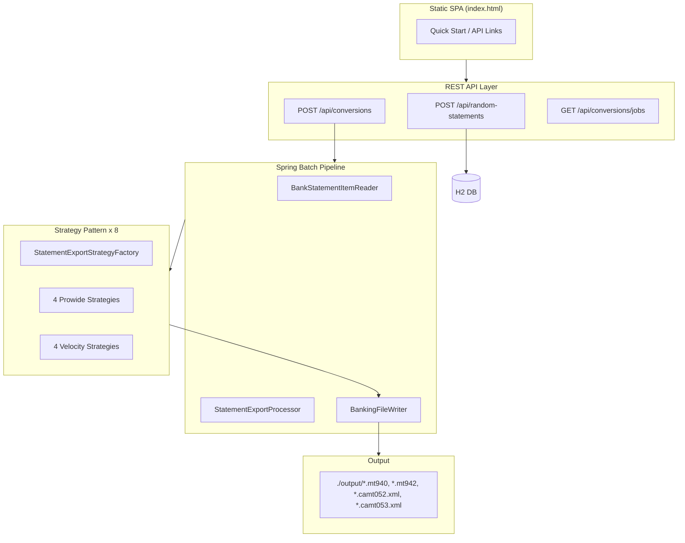

# Banking Statement Converter Platform

[](https://github.com/wallaceespindola/camt-mt-converters/actions/workflows/build.yml)
[](https://github.com/wallaceespindola/camt-mt-converters/actions/workflows/test.yml)
[](https://github.com/wallaceespindola/camt-mt-converters/actions/workflows/codeql.yml)
[](https://adoptium.net/)
[](https://spring.io/projects/spring-boot)
[](LICENSE)

Enterprise-grade banking statement converter platform. Converts internal domain data to **MT940, MT942, camt.052,
camt.053** banking file formats using **Prowide Core + ISO 20022**, via **Spring Batch** and the **Strategy Pattern**.

---

## Overview

This platform is a technical laboratory and production-ready reference implementation for banking format conversion.
Engineers can generate realistic bank statement datasets and trigger Spring Batch export jobs that produce standards-
compliant SWIFT MT and ISO 20022 camt files via either the Prowide library suite or Apache Velocity templates.

Two parallel conversion engines are available behind a single `StatementExportStrategy` interface. The Prowide engine
uses strongly-typed, standards-aware Java objects for MT940, MT942, camt.052, and camt.053. The Velocity engine uses
declarative `.vm` templates for the same four formats — both engines produce output validated against the same MT field
rules and ISO 20022 XSD before any file is written to disk.

The system is designed to be extended without modification: adding a new format or engine means implementing one
interface and annotating the class `@Component`. The `StatementExportStrategyFactory` auto-discovers all registered
strategies at startup via Spring dependency injection — no `if`/`switch` chains required.

---

## Architecture



### Batch Pipeline

```
BankStatementItemReader (H2)
    → StatementExportProcessor (resolves strategy via factory)
    → BankingFileWriter (writes to ./output/)
```

Each Spring Batch job is parameterised by `statementId`, `targetFormat` (MT940/MT942/CAMT052/CAMT053), and `engine`
(PROWIDE/VELOCITY). Jobs are uniquely keyed and independently restartable.

### Strategy Pattern

Eight strategy implementations — one per `ConversionTargetFormat x ConversionEngine` combination — all behind a single
`StatementExportStrategy` interface. The composite key `StatementExportStrategyKey(targetFormat, engine)` drives
resolution with no branching logic in the factory.

---

## Supported Banking Formats

| Standard    | Format    | Description                                       | Authority  |
|-------------|-----------|---------------------------------------------------|------------|
| SWIFT MT    | MT940     | Customer Statement Message — end-of-day           | SWIFT      |
| SWIFT MT    | MT942     | Interim Transaction Report — intraday             | SWIFT      |
| ISO 20022   | camt.052  | Bank-to-Customer Account Report — intraday        | ISO / BIS  |
| ISO 20022   | camt.053  | Bank-to-Customer Statement — end-of-day           | ISO / BIS  |

**Functional equivalence**: MT940 corresponds to camt.053 (end-of-day); MT942 corresponds to camt.052 (intraday).

---

## Conversion Engine Comparison

| Engine            | Formats                          | Type-Safety    | Risk |
|-------------------|----------------------------------|----------------|------|
| Prowide Core      | MT940, MT942                     | High           | Low  |
| Prowide ISO 20022 | camt.052, camt.053               | High           | Low  |
| Apache Velocity   | MT940, MT942, camt.052, camt.053 | Template-based | Low  |

The Prowide engine uses structured Java objects (e.g. `MT940`, `Field60F`) that enforce field-level SWIFT constraints at
compile time. The Velocity engine uses `.vm` templates in `src/main/resources/templates/` and is useful for rapid format
iteration or human-readable template editing. Both engines pass the same post-generation validation before any file is
committed to disk.

---

## Quick Start

### Prerequisites

- Java 21+ (tested with Amazon Corretto 21 and Eclipse Temurin 21)
- Maven 3.9+
- `make` _(optional — simplifies commands; see install instructions below)_

#### Installing `make`

| Platform            | Command                                                                                         |
|---------------------|-------------------------------------------------------------------------------------------------|
| **macOS**           | Already available via Xcode Command Line Tools: `xcode-select --install`                        |
| **Ubuntu / Debian** | `sudo apt-get install -y make`                                                                  |
| **Fedora / RHEL**   | `sudo dnf install -y make`                                                                      |
| **Windows**         | Via [Git for Windows](https://gitforwindows.org/), [Chocolatey](https://chocolatey.org/) (`choco install make`), or [Scoop](https://scoop.sh/) (`scoop install make`) |

Verify with: `make --version`

### Build and Run

Each command is shown with `# with make` and `# direct` alternatives.

```bash
# Full build — compile + tests + JaCoCo coverage + install
mvn clean install

# Compile and package (skips tests)
# with make
make build
# direct
mvn clean package -DskipTests

# Start in dev mode — Swagger UI enabled at http://localhost:8080/swagger-ui.html
# with make
make run
# direct
mvn spring-boot:run -Dspring-boot.run.profiles=dev

# Start without dev profile (no Swagger)
# with make
make run-prod
# direct
mvn spring-boot:run

# Run all tests (unit + integration) with JaCoCo coverage
# with make
make test
# direct
mvn verify

# Run unit tests only
# with make
make test-unit
# direct
mvn test -Dtest="*Test" -DfailIfNoTests=false

# Run integration tests only
# with make
make test-integration
# direct
mvn verify -Dtest="*IntegrationTest,*IT" -DfailIfNoTests=false

# Run a single test class
mvn test -Dtest=StrategyFactoryTest

# Remove build artifacts and generated output files
# with make
make clean
# direct
mvn clean

# Kill any running Spring Boot process (free port 8080) — make only
make kill

# Run static analysis (compiler warnings) — make only
make lint

# Generate JaCoCo HTML coverage report → target/site/jacoco/index.html — make only
make docs

# List all available make targets with descriptions — make only
make help
```

Application starts at **http://localhost:8080**
Swagger UI (dev profile only): **http://localhost:8080/swagger-ui.html**
Static quick-start page: **http://localhost:8080/static/index.html**

---

## REST API

| Method | Endpoint                            | Description                                              |
|--------|-------------------------------------|----------------------------------------------------------|
| `POST` | `/api/random-statements`            | Generate and persist a random `BankStatement` in H2      |
| `POST` | `/api/conversions`                  | Launch Spring Batch export job for a given statement     |
| `GET`  | `/api/conversions/jobs/{jobId}`     | Poll batch job execution status by job ID                |
| `GET`  | `/api/conversions/jobs`             | List all batch job executions                            |
| `GET`  | `/actuator/health`                  | Application health                                       |
| `GET`  | `/actuator/info`                    | Application build metadata                               |

### Load Profiles

`POST /api/random-statements` accepts an optional `loadProfile` query parameter:

| Profile | Statements | Transactions per Statement | Notes       |
|---------|------------|----------------------------|-------------|
| `LOW`   | 1          | ~10                        | Default     |
| `HIGH`  | 10         | ~100                       | Stress test |

### Example: Generate Data and Convert

```bash
# Step 1: Generate random statement data
curl -s -X POST http://localhost:8080/api/random-statements | jq .

# Step 2: Convert to MT940 using Prowide
curl -s -X POST http://localhost:8080/api/conversions \
  -H "Content-Type: application/json" \
  -d '{"statementId":1,"targetFormat":"MT940","engine":"PROWIDE"}' | jq .

# Step 3: Check job status
curl -s http://localhost:8080/api/conversions/jobs/1 | jq .

# Step 4: List all jobs
curl -s http://localhost:8080/api/conversions/jobs | jq .
```

### Load Profile and Format Variants

```bash
# HIGH load (10 statements x 100 transactions)
curl -s -X POST "http://localhost:8080/api/random-statements?loadProfile=HIGH" | jq .

# Convert to camt.053 using Prowide
curl -s -X POST http://localhost:8080/api/conversions \
  -H "Content-Type: application/json" \
  -d '{"statementId":1,"targetFormat":"CAMT053","engine":"PROWIDE"}' | jq .

# Convert to MT942 using Velocity template engine
curl -s -X POST http://localhost:8080/api/conversions \
  -H "Content-Type: application/json" \
  -d '{"statementId":1,"targetFormat":"MT942","engine":"VELOCITY"}' | jq .

# Convert to camt.052 using Velocity
curl -s -X POST http://localhost:8080/api/conversions \
  -H "Content-Type: application/json" \
  -d '{"statementId":1,"targetFormat":"CAMT052","engine":"VELOCITY"}' | jq .
```

---

## Makefile Commands

| Command              | Description                                                     |
|----------------------|-----------------------------------------------------------------|
| `make build`         | Compile and package (skips tests)                               |
| `make run`           | Start in dev mode (Swagger UI at `/swagger-ui.html`)            |
| `make run-prod`      | Start without dev profile (no Swagger)                          |
| `make test`          | Run all tests with JaCoCo coverage                              |
| `make test-unit`     | Unit tests only                                                 |
| `make test-integration` | Integration tests only                                       |
| `make clean`         | Remove build artifacts and generated output files               |
| `make kill`          | Kill Spring Boot process (port 8080)                            |
| `make lint`          | Run compiler warnings via static analysis                       |
| `make docs`          | Generate JaCoCo coverage report to `target/site/jacoco/`        |
| `make help`          | Show all commands with descriptions                             |

---

## Strategy Pattern

Eight strategies are registered at startup via Spring DI. The `StatementExportStrategyFactory` resolves the correct
implementation at runtime from a composite key of `(ConversionTargetFormat, ConversionEngine)` — no `if`/`switch`
chains anywhere in the resolution path.

| Class                               | Format    | Engine   |
|-------------------------------------|-----------|----------|
| `InternalToMt940ProwideStrategy`    | MT940     | PROWIDE  |
| `InternalToMt942ProwideStrategy`    | MT942     | PROWIDE  |
| `InternalToCamt052ProwideStrategy`  | camt.052  | PROWIDE  |
| `InternalToCamt053ProwideStrategy`  | camt.053  | PROWIDE  |
| `InternalToMt940VelocityStrategy`   | MT940     | VELOCITY |
| `InternalToMt942VelocityStrategy`   | MT942     | VELOCITY |
| `InternalToCamt052VelocityStrategy` | camt.052  | VELOCITY |
| `InternalToCamt053VelocityStrategy` | camt.053  | VELOCITY |

Adding a new strategy: implement `StatementExportStrategy`, return the appropriate `StatementExportStrategyKey` from
`key()`, and annotate with `@Component`. The factory auto-discovers it — no other changes required.

---

## Swagger UI

Swagger UI is available **only in the `dev` profile**:

```
http://localhost:8080/swagger-ui.html
http://localhost:8080/v3/api-docs
```

```bash
# with make
make run
# direct
mvn spring-boot:run -Dspring-boot.run.profiles=dev
```

In any other profile, `springdoc.swagger-ui.enabled` and `springdoc.api-docs.enabled` are both `false`.

---

## Spring Actuator

```bash
# Health check (public — shows DB and custom version indicator)
curl http://localhost:8080/actuator/health

# Application info (build metadata injected by spring-boot-maven-plugin build-info goal)
curl http://localhost:8080/actuator/info
```

Sample `actuator/info` response:

```json
{
  "app": {
    "name": "camt-mt-converters",
    "description": "Banking Statement Converter Platform",
    "version": "1.0.0-SNAPSHOT",
    "author": "Wallace Espindola"
  },
  "build": {
    "artifact": "camt-mt-converters",
    "version": "1.0.0-SNAPSHOT",
    "time": "2026-05-14T10:00:00.000Z"
  }
}
```

---

## Validation Chain

Every conversion passes three sequential validation stages before the file is written:

1. **Internal model** — Bean Validation on the domain `BankStatement` record (IBAN present, currency valid, balances
   non-null, at least one transaction).
2. **MT output** — Prowide Core re-parses generated MT content and confirms required fields are present (`Field20`,
   `Field25`, `Field60F`, `Field62F`, etc.).
3. **camt output** — Generated XML is validated against the ISO 20022 XSD before `BankingFileWriter` commits it to
   disk.

Velocity-generated output passes through the same MT/camt validation gate — it is never written raw.

---

## Output Files

Generated under `./output/` (gitignored, `.gitkeep` preserves the directory):

```
output/
├── statement-{id}.mt940
├── statement-{id}.mt942
├── statement-{id}.camt052.xml
└── statement-{id}.camt053.xml
```

---

## Testing Strategy

| Category               | Test Class                                            | Tools                    |
|------------------------|-------------------------------------------------------|--------------------------|
| Unit — strategies      | `InternalToMt940ProwideStrategyTest`, et al.          | JUnit 5 + Mockito        |
| Unit — factory         | `StrategyFactoryTest`                                 | JUnit 5 + Mockito        |
| Unit — mapper          | `BankStatementMapperTest`                             | JUnit 5                  |
| Unit — random service  | `RandomStatementServiceTest`                          | JUnit 5 + Mockito        |
| Spring Batch           | `StatementExportJobIntegrationTest`                   | `@SpringBatchTest`       |
| REST API               | `RandomStatementControllerTest`, `ConversionControllerTest` | MockMvc            |
| Actuator               | `ActuatorIntegrationTest`                             | `TestRestTemplate`       |
| Swagger                | `SwaggerAvailabilityTest`                             | `TestRestTemplate`       |
| Golden file            | `Mt940GoldenFileTest`, `Camt053GoldenFileTest`        | JUnit 5 + file assertion |

Target coverage: **>80%** (JaCoCo instruction coverage enforced at `mvn verify`).

```bash
# All tests with JaCoCo
make test

# Single test class
mvn test -Dtest=StrategyFactoryTest

# Single test method
mvn test -Dtest=InternalToMt940ProwideStrategyTest#shouldGenerateMt940File
```

---

## Repository Structure

```
camt-mt-converters/
├── pom.xml                                Maven build descriptor
├── Makefile                               Developer commands
├── LICENSE                                Apache 2.0
├── .env.example                           Environment variable reference
├── .github/
│   ├── workflows/
│   │   ├── build.yml                      CI — compile + package
│   │   ├── test.yml                       CI — full test suite
│   │   ├── codeql.yml                     CodeQL security analysis
│   │   └── release.yml                    Release pipeline
│   ├── dependabot.yml                     Dependency update automation
│   ├── PULL_REQUEST_TEMPLATE.md
│   └── ISSUE_TEMPLATE/
├── docs/
│   ├── PRD.md                             Product requirements document
│   ├── CHANGELOG.md
│   ├── CONTRIBUTING.md
│   ├── architecture.md
│   └── examples/
│       ├── mt940/valid_mt940_sample.txt
│       ├── mt942/valid_mt942_sample.txt
│       ├── camt052/valid_camt052_sample.xml
│       └── camt053/valid_camt053_sample.xml
├── src/main/java/com/wtechitsolutions/bankingconverter/
│   ├── BankingConverterApplication.java
│   ├── api/                               REST controllers + DTO records
│   │   ├── RandomStatementController.java
│   │   ├── StatementConversionController.java
│   │   ├── GlobalExceptionHandler.java
│   │   └── dto/                           Java Records (request/response)
│   ├── batch/                             Spring Batch reader / processor / writer / listener
│   │   ├── BankStatementItemReader.java
│   │   ├── StatementExportProcessor.java
│   │   ├── BankingFileWriter.java
│   │   └── BatchJobMetricsListener.java
│   ├── conversion/                        Strategy interface, enums, factory, key, file record
│   │   ├── StatementExportStrategy.java
│   │   ├── StatementExportStrategyFactory.java
│   │   ├── StatementExportStrategyKey.java
│   │   ├── ConversionTargetFormat.java
│   │   ├── ConversionEngine.java
│   │   ├── GeneratedBankingFile.java
│   │   └── strategy/
│   │       ├── prowide/                   4 Prowide strategies + abstract base
│   │       └── velocity/                  4 Velocity strategies
│   ├── config/                            Spring, Batch, OpenAPI, Web config + VersionHealthIndicator
│   ├── domain/                            BankStatement, BankTransaction, DebitCreditIndicator, LoadProfile
│   ├── persistence/
│   │   ├── entity/                        JPA entities (BankStatementEntity, BankTransactionEntity)
│   │   └── repository/                   Spring Data repositories
│   ├── mapper/                            BankStatementMapper (MapStruct)
│   ├── random/                            RandomStatementService
│   ├── template/                          VelocityRenderer
│   ├── validation/                        InternalStatementValidator
│   └── exception/                         ConversionException, JobLaunchException
├── src/main/resources/
│   ├── application.yml
│   ├── application-dev.yml
│   ├── static/index.html                  Quick-start SPA
│   └── templates/                         Velocity templates
│       ├── mt940.vm
│       ├── mt942.vm
│       ├── camt052.vm
│       └── camt053.vm
├── src/test/java/                         Mirror of main package — unit + integration tests
└── output/                               Generated files (gitignored; .gitkeep preserves dir)
```

---

## Links

- [SWIFT MT Standards](https://www.swift.com/standards/data-standards/mt)
- [ISO 20022 camt Message Catalogue](https://www.iso20022.org/catalogue-messages/iso-20022-messages-archive?search=camt)
- [Prowide Core on GitHub](https://github.com/prowide/prowide-core)
- [Prowide ISO 20022 on GitHub](https://github.com/prowide/prowide-iso20022)
- [Apache Velocity Engine](https://velocity.apache.org/engine/2.3/)
- [Spring Batch Reference](https://docs.spring.io/spring-batch/docs/current/reference/html/)

---

## Author

**Wallace Espindola**

- Email: [wallace.espindola@gmail.com](mailto:wallace.espindola@gmail.com)
- LinkedIn: [linkedin.com/in/wallaceespindola](https://www.linkedin.com/in/wallaceespindola/)
- GitHub: [github.com/wallaceespindola](https://github.com/wallaceespindola/)
